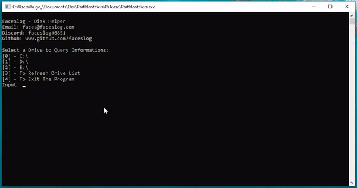

# WinPartId

**Users:**
A simple tool to query data about your drives instead of using `diskpart` ! 
**Developers:**
Some ready to use functions to query data about your drives to save you some time (`WinDisk.h, WinDisk.cpp`) in **C++**:
- **Size**
- **Volume GUID**
- **Disk Numbers**
- [**Partitions Data**](https://docs.microsoft.com/en-us/windows/win32/api/winioctl/ns-winioctl-partition_information_ex)  
- [**GPT: Size, Type, ParitionId, Attributes**](https://docs.microsoft.com/en-us/windows/win32/api/winioctl/ns-winioctl-partition_information_gpt) 
- [**MBR: Type, BootIndicator, RecognizedPartition, Hidden Sectors, PartitionId**](https://docs.microsoft.com/en-us/windows/win32/api/winioctl/ns-winioctl-partition_information_mbr) 
- [**More**](https://docs.microsoft.com/en-us/windows/win32/fileio/basic-and-dynamic-disks?redirectedfrom=MSDN#detecting-the-type-of-disk) 

## Why ?
This project was created with the goal to help some friends and myself to identify partitions in Windows Systems with a lot of drives and partitions.
Using `diskpart` would have slow us down a lot. I could have done it in another way but it was a good challenge to use the Win API. 
To Identify a Partition Type you can use the [GUID PARTITION TABLE](https://en.wikipedia.org/wiki/GUID_Partition_Table). (One is avalaible below)
 
## License
Distributed under the *GNU General Public License*. See `LICENSE` for more information.
 
 ## GUID PARTITION TABLE (src: Wikipedia)
<table class="wikitable mw-collapsible mw-made-collapsible">
<tbody><tr>
<th>Operating system
</th>
<th>Partition type
</th>
<th style="width: 23em;"><a class="mw-collapsible-text">hide</a>Globally unique identifier (GUID)<a href="#cite_note-33">[d]</a>
</th></tr>
<tr style="background:#f0f0f0;">
<td rowspan="7" data-sort-value="" style="background: #ececec; color: #2C2C2C; vertical-align: middle; text-align: center;" class="table-na">N/A
</td>
<td>Unused entry
</td>
<td><link rel="mw-deduplicated-inline-style" href="mw-data:TemplateStyles:r886049734">00000000-0000-0000-0000-000000000000
</td></tr>
<tr>
<td style="background:#f0f0f0;"><a href="/wiki/Master_Boot_Record" class="mw-redirect" title="Master Boot Record">MBR</a> partition scheme
</td>
<td style="background:#f0f0f0;"><link rel="mw-deduplicated-inline-style" href="mw-data:TemplateStyles:r886049734">024DEE41-33E7-11D3-9D69-0008C781F39F
</td></tr>
<tr style="background:#f0f0f0;">
<td><a href="/wiki/EFI_System_partition" class="mw-redirect" title="EFI System partition">EFI System partition</a>
</td>
<td><link rel="mw-deduplicated-inline-style" href="mw-data:TemplateStyles:r886049734">C12A7328-F81F-11D2-BA4B-00A0C93EC93B
</td></tr>
<tr>
<td style="background:#f0f0f0;"><a href="/wiki/BIOS_boot_partition" title="">BIOS boot partition</a><a href="#cite_note-34">[e]</a>
</td>
<td style="background:#f0f0f0;"><link rel="mw-deduplicated-inline-style" href="mw-data:TemplateStyles:r886049734">21686148-6449-6E6F-744E-656564454649
</td></tr>
<tr style="background:#f0f0f0;">
<td>Intel Fast Flash (iFFS) partition (for Intel Rapid Start technology)<a href="#cite_note-Gigabyte_2012_RS-35">[30]</a><a href="#cite_note-36">[31]</a>
</td>
<td><link rel="mw-deduplicated-inline-style" href="mw-data:TemplateStyles:r886049734">D3BFE2DE-3DAF-11DF-BA40-E3A556D89593
</td></tr>
<tr>
<td style="background:#f0f0f0;">Sony boot partition<a href="#cite_note-manufacturerbootpartition-38">[f]</a>
</td>
<td style="background:#f0f0f0;"><link rel="mw-deduplicated-inline-style" href="mw-data:TemplateStyles:r886049734">F4019732-066E-4E12-8273-346C5641494F
</td></tr>
<tr>
<td style="background:#f0f0f0;">Lenovo boot partition<a href="#cite_note-manufacturerbootpartition-38">[f]</a>
</td>
<td style="background:#f0f0f0;"><link rel="mw-deduplicated-inline-style" href="mw-data:TemplateStyles:r886049734">BFBFAFE7-A34F-448A-9A5B-6213EB736C22
</td></tr>
<tr>
<td rowspan="8"><a href="/wiki/Microsoft_Windows" title="Microsoft Windows">Windows</a>
</td>
<td><a href="/wiki/Microsoft_Reserved_Partition" title="Microsoft Reserved Partition">Microsoft Reserved Partition</a> (MSR)
</td>
<td><link rel="mw-deduplicated-inline-style" href="mw-data:TemplateStyles:r886049734">E3C9E316-0B5C-4DB8-817D-F92DF00215AE
</td></tr>
<tr>
<td><a href="/wiki/Microsoft_basic_data_partition" title="Microsoft basic data partition">Basic data partition</a><a href="#cite_note-linwin-40">[g]</a>
</td>
<td><link rel="mw-deduplicated-inline-style" href="mw-data:TemplateStyles:r886049734">EBD0A0A2-B9E5-4433-87C0-68B6B72699C7
</td></tr>
<tr>
<td><a href="/wiki/Logical_Disk_Manager" title="Logical Disk Manager">Logical Disk Manager</a> (LDM) metadata partition
</td>
<td><link rel="mw-deduplicated-inline-style" href="mw-data:TemplateStyles:r886049734">5808C8AA-7E8F-42E0-85D2-E1E90434CFB3
</td></tr>
<tr>
<td>Logical Disk Manager data partition
</td>
<td><link rel="mw-deduplicated-inline-style" href="mw-data:TemplateStyles:r886049734">AF9B60A0-1431-4F62-BC68-3311714A69AD
</td></tr>
<tr>
<td><a href="/wiki/Windows_Recovery_Environment" class="mw-redirect" title="Windows Recovery Environment">Windows Recovery Environment</a>
</td>
<td><link rel="mw-deduplicated-inline-style" href="mw-data:TemplateStyles:r886049734">DE94BBA4-06D1-4D40-A16A-BFD50179D6AC
</td></tr>
<tr>
<td><a href="/wiki/IBM_General_Parallel_File_System" class="mw-redirect" title="IBM General Parallel File System">IBM General Parallel File System</a> (GPFS) partition
</td>
<td><link rel="mw-deduplicated-inline-style" href="mw-data:TemplateStyles:r886049734">37AFFC90-EF7D-4E96-91C3-2D7AE055B174
</td></tr>
<tr>
<td><a href="/wiki/Storage_Spaces" class="mw-redirect" title="Storage Spaces">Storage Spaces</a> partition
</td>
<td><link rel="mw-deduplicated-inline-style" href="mw-data:TemplateStyles:r886049734">E75CAF8F-F680-4CEE-AFA3-B001E56EFC2D
</td></tr>
<tr>
<td>Storage Replica partition<a href="#cite_note-microsoft-storage-replica-partition-41">[34]</a>
</td>
<td><link rel="mw-deduplicated-inline-style" href="mw-data:TemplateStyles:r886049734">558D43C5-A1AC-43C0-AAC8-D1472B2923D1
</td></tr>
<tr style="background:#f0f0f0;">
<td rowspan="2"><a href="/wiki/HP-UX" title="HP-UX">HP-UX</a>
</td>
<td>Data partition
</td>
<td><link rel="mw-deduplicated-inline-style" href="mw-data:TemplateStyles:r886049734">75894C1E-3AEB-11D3-B7C1-7B03A0000000
</td></tr>
<tr style="background:#f0f0f0;">
<td>Service partition
</td>
<td><link rel="mw-deduplicated-inline-style" href="mw-data:TemplateStyles:r886049734">E2A1E728-32E3-11D6-A682-7B03A0000000
</td></tr>
<tr>
<td rowspan="14"><a href="/wiki/Linux" title="Linux">Linux</a>
</td>
<td>Linux filesystem data<a href="#cite_note-linwin-40">[g]</a>
</td>
<td><link rel="mw-deduplicated-inline-style" href="mw-data:TemplateStyles:r886049734">0FC63DAF-8483-4772-8E79-3D69D8477DE4
</td></tr>
<tr>
<td>RAID partition
</td>
<td><link rel="mw-deduplicated-inline-style" href="mw-data:TemplateStyles:r886049734">A19D880F-05FC-4D3B-A006-743F0F84911E
</td></tr>
<tr>
<td>Root partition (x86)<a href="#cite_note-DiscoverablePartitionsSpec-42">[35]</a><a href="#cite_note-man-systemd-gpt-auto-generator-43">[36]</a>
</td>
<td><link rel="mw-deduplicated-inline-style" href="mw-data:TemplateStyles:r886049734">44479540-F297-41B2-9AF7-D131D5F0458A
</td></tr>
<tr>
<td>Root partition (x86-64)<a href="#cite_note-DiscoverablePartitionsSpec-42">[35]</a><a href="#cite_note-man-systemd-gpt-auto-generator-43">[36]</a>
</td>
<td><link rel="mw-deduplicated-inline-style" href="mw-data:TemplateStyles:r886049734">4F68BCE3-E8CD-4DB1-96E7-FBCAF984B709
</td></tr>
<tr>
<td>Root partition (32-bit ARM)<a href="#cite_note-DiscoverablePartitionsSpec-42">[35]</a><a href="#cite_note-man-systemd-gpt-auto-generator-43">[36]</a>
</td>
<td><link rel="mw-deduplicated-inline-style" href="mw-data:TemplateStyles:r886049734">69DAD710-2CE4-4E3C-B16C-21A1D49ABED3
</td></tr>
<tr>
<td>Root partition (64-bit ARM/AArch64)<a href="#cite_note-DiscoverablePartitionsSpec-42">[35]</a><a href="#cite_note-man-systemd-gpt-auto-generator-43">[36]</a>
</td>
<td><link rel="mw-deduplicated-inline-style" href="mw-data:TemplateStyles:r886049734">B921B045-1DF0-41C3-AF44-4C6F280D3FAE
</td></tr>
<tr>
<td><link rel="mw-deduplicated-inline-style" href="mw-data:TemplateStyles:r886049734">/boot partition<a href="#cite_note-DiscoverablePartitionsSpec-42">[35]</a><a href="#cite_note-man-systemd-gpt-auto-generator-43">[36]</a>
</td>
<td><link rel="mw-deduplicated-inline-style" href="mw-data:TemplateStyles:r886049734">BC13C2FF-59E6-4262-A352-B275FD6F7172
</td></tr>
<tr>
<td>Swap partition<a href="#cite_note-DiscoverablePartitionsSpec-42">[35]</a><a href="#cite_note-man-systemd-gpt-auto-generator-43">[36]</a>
</td>
<td><link rel="mw-deduplicated-inline-style" href="mw-data:TemplateStyles:r886049734">0657FD6D-A4AB-43C4-84E5-0933C84B4F4F
</td></tr>
<tr>
<td><a href="/wiki/Logical_Volume_Manager_(Linux)" title="Logical Volume Manager (Linux)">Logical Volume Manager</a> (LVM) partition
</td>
<td><link rel="mw-deduplicated-inline-style" href="mw-data:TemplateStyles:r886049734">E6D6D379-F507-44C2-A23C-238F2A3DF928
</td></tr>
<tr>
<td><link rel="mw-deduplicated-inline-style" href="mw-data:TemplateStyles:r886049734">/home partition<a href="#cite_note-DiscoverablePartitionsSpec-42">[35]</a><a href="#cite_note-man-systemd-gpt-auto-generator-43">[36]</a>
</td>
<td><link rel="mw-deduplicated-inline-style" href="mw-data:TemplateStyles:r886049734">933AC7E1-2EB4-4F13-B844-0E14E2AEF915
</td></tr>
<tr>
<td><link rel="mw-deduplicated-inline-style" href="mw-data:TemplateStyles:r886049734">/srv (server data) partition<a href="#cite_note-DiscoverablePartitionsSpec-42">[35]</a><a href="#cite_note-man-systemd-gpt-auto-generator-43">[36]</a>
</td>
<td><link rel="mw-deduplicated-inline-style" href="mw-data:TemplateStyles:r886049734">3B8F8425-20E0-4F3B-907F-1A25A76F98E8
</td></tr>
<tr>
<td>Plain <a href="/wiki/Dm-crypt" title="Dm-crypt">dm-crypt</a> partition<a href="#cite_note-saout1-44">[37]</a><a href="#cite_note-saout2-45">[38]</a><a href="#cite_note-pyuefi-46">[39]</a>
</td>
<td><link rel="mw-deduplicated-inline-style" href="mw-data:TemplateStyles:r886049734">7FFEC5C9-2D00-49B7-8941-3EA10A5586B7
</td></tr>
<tr>
<td><a href="/wiki/Linux_Unified_Key_Setup" title="Linux Unified Key Setup">LUKS</a> partition<a href="#cite_note-saout1-44">[37]</a><a href="#cite_note-saout2-45">[38]</a><a href="#cite_note-pyuefi-46">[39]</a><a href="#cite_note-usdisks-47">[40]</a>
</td>
<td><link rel="mw-deduplicated-inline-style" href="mw-data:TemplateStyles:r886049734">CA7D7CCB-63ED-4C53-861C-1742536059CC
</td></tr>
<tr>
<td>Reserved
</td>
<td><link rel="mw-deduplicated-inline-style" href="mw-data:TemplateStyles:r886049734">8DA63339-0007-60C0-C436-083AC8230908
</td></tr>
<tr style="background:#f0f0f0;">
<td rowspan="6"><a href="/wiki/FreeBSD" title="FreeBSD">FreeBSD</a>
</td>
<td>Boot partition
</td>
<td><link rel="mw-deduplicated-inline-style" href="mw-data:TemplateStyles:r886049734">83BD6B9D-7F41-11DC-BE0B-001560B84F0F
</td></tr>
<tr style="background:#f0f0f0;">
<td>Data partition
</td>
<td><link rel="mw-deduplicated-inline-style" href="mw-data:TemplateStyles:r886049734">516E7CB4-6ECF-11D6-8FF8-00022D09712B
</td></tr>
<tr style="background:#f0f0f0;">
<td>Swap partition
</td>
<td><link rel="mw-deduplicated-inline-style" href="mw-data:TemplateStyles:r886049734">516E7CB5-6ECF-11D6-8FF8-00022D09712B
</td></tr>
<tr style="background:#f0f0f0;">
<td><a href="/wiki/Unix_File_System" title="Unix File System">Unix File System</a> (UFS) partition
</td>
<td><link rel="mw-deduplicated-inline-style" href="mw-data:TemplateStyles:r886049734">516E7CB6-6ECF-11D6-8FF8-00022D09712B
</td></tr>
<tr style="background:#f0f0f0;">
<td><a href="/wiki/Vinum_volume_manager" title="Vinum volume manager">Vinum volume manager</a> partition
</td>
<td><link rel="mw-deduplicated-inline-style" href="mw-data:TemplateStyles:r886049734">516E7CB8-6ECF-11D6-8FF8-00022D09712B
</td></tr>
<tr style="background:#f0f0f0;">
<td><a href="/wiki/ZFS" title="ZFS">ZFS</a> partition
</td>
<td><link rel="mw-deduplicated-inline-style" href="mw-data:TemplateStyles:r886049734">516E7CBA-6ECF-11D6-8FF8-00022D09712B
</td></tr>
<tr>
<td rowspan="14"><a href="/wiki/MacOS" title="MacOS">macOS</a> <a href="/wiki/Darwin_(operating_system)" title="Darwin (operating system)">Darwin</a>
</td>
<td><a href="/wiki/Hierarchical_File_System_Plus" class="mw-redirect" title="Hierarchical File System Plus">Hierarchical File System Plus</a> (HFS+) partition
</td>
<td><link rel="mw-deduplicated-inline-style" href="mw-data:TemplateStyles:r886049734">48465300-0000-11AA-AA11-00306543ECAC
</td></tr>
<tr>
<td><a href="/wiki/Apple_Inc." title="Apple Inc.">Apple</a> <a href="/wiki/Apple_File_System" title="Apple File System">APFS</a> container APFS <a href="/wiki/FileVault" title="FileVault">FileVault</a> volume container
</td>
<td><link rel="mw-deduplicated-inline-style" href="mw-data:TemplateStyles:r886049734">7C3457EF-0000-11AA-AA11-00306543ECAC
</td></tr>
<tr>
<td><a href="/wiki/Apple_Inc." title="Apple Inc.">Apple</a> <a href="/wiki/Unix_File_System" title="Unix File System">UFS</a> container
</td>
<td><link rel="mw-deduplicated-inline-style" href="mw-data:TemplateStyles:r886049734">55465300-0000-11AA-AA11-00306543ECAC
</td></tr>
<tr>
<td><a href="/wiki/ZFS" title="ZFS">ZFS</a><a href="#cite_note-solmac-48">[h]</a>
</td>
<td><link rel="mw-deduplicated-inline-style" href="mw-data:TemplateStyles:r886049734">6A898CC3-1DD2-11B2-99A6-080020736631
</td></tr>
<tr>
<td>Apple RAID partition
</td>
<td><link rel="mw-deduplicated-inline-style" href="mw-data:TemplateStyles:r886049734">52414944-0000-11AA-AA11-00306543ECAC
</td></tr>
<tr>
<td>Apple RAID partition, offline
</td>
<td><link rel="mw-deduplicated-inline-style" href="mw-data:TemplateStyles:r886049734">52414944-5F4F-11AA-AA11-00306543ECAC
</td></tr>
<tr>
<td>Apple Boot partition (Recovery HD)
</td>
<td><link rel="mw-deduplicated-inline-style" href="mw-data:TemplateStyles:r886049734">426F6F74-0000-11AA-AA11-00306543ECAC
</td></tr>
<tr>
<td>Apple Label
</td>
<td><link rel="mw-deduplicated-inline-style" href="mw-data:TemplateStyles:r886049734">4C616265-6C00-11AA-AA11-00306543ECAC
</td></tr>
<tr>
<td>Apple TV Recovery partition
</td>
<td><link rel="mw-deduplicated-inline-style" href="mw-data:TemplateStyles:r886049734">5265636F-7665-11AA-AA11-00306543ECAC
</td></tr>
<tr>
<td>Apple <a href="/wiki/Core_Storage" title="Core Storage">Core Storage</a> Container HFS+ <a href="/wiki/FileVault" title="FileVault">FileVault</a> volume container
</td>
<td><link rel="mw-deduplicated-inline-style" href="mw-data:TemplateStyles:r886049734">53746F72-6167-11AA-AA11-00306543ECAC
</td></tr>
<tr>
<td>SoftRAID_Status
</td>
<td><link rel="mw-deduplicated-inline-style" href="mw-data:TemplateStyles:r886049734">B6FA30DA-92D2-4A9A-96F1-871EC6486200
</td></tr>
<tr>
<td>SoftRAID_Scratch
</td>
<td><link rel="mw-deduplicated-inline-style" href="mw-data:TemplateStyles:r886049734">2E313465-19B9-463F-8126-8A7993773801
</td></tr>
<tr>
<td>SoftRAID_Volume
</td>
<td><link rel="mw-deduplicated-inline-style" href="mw-data:TemplateStyles:r886049734">FA709C7E-65B1-4593-BFD5-E71D61DE9B02
</td></tr>
<tr>
<td>SoftRAID_Cache
</td>
<td><link rel="mw-deduplicated-inline-style" href="mw-data:TemplateStyles:r886049734">BBBA6DF5-F46F-4A89-8F59-8765B2727503
</td></tr>
<tr>
<td style="background:#f0f0f0;" rowspan="13"><a href="/wiki/Solaris_(operating_system)" class="mw-redirect" title="Solaris (operating system)">Solaris</a> <a href="/wiki/Illumos" title="Illumos">illumos</a>
</td>
<td style="background:#f0f0f0;">Boot partition
</td>
<td style="background:#f0f0f0;"><link rel="mw-deduplicated-inline-style" href="mw-data:TemplateStyles:r886049734">6A82CB45-1DD2-11B2-99A6-080020736631
</td></tr>
<tr style="background:#f0f0f0;">
<td>Root partition
</td>
<td><link rel="mw-deduplicated-inline-style" href="mw-data:TemplateStyles:r886049734">6A85CF4D-1DD2-11B2-99A6-080020736631
</td></tr>
<tr style="background:#f0f0f0;">
<td>Swap partition
</td>
<td><link rel="mw-deduplicated-inline-style" href="mw-data:TemplateStyles:r886049734">6A87C46F-1DD2-11B2-99A6-080020736631
</td></tr>
<tr style="background:#f0f0f0;">
<td>Backup partition
</td>
<td><link rel="mw-deduplicated-inline-style" href="mw-data:TemplateStyles:r886049734">6A8B642B-1DD2-11B2-99A6-080020736631
</td></tr>
<tr>
<td style="background:#f0f0f0;"><link rel="mw-deduplicated-inline-style" href="mw-data:TemplateStyles:r886049734">/usr partition<a href="#cite_note-solmac-48">[h]</a>
</td>
<td style="background:#f0f0f0;"><link rel="mw-deduplicated-inline-style" href="mw-data:TemplateStyles:r886049734">6A898CC3-1DD2-11B2-99A6-080020736631
</td></tr>
<tr style="background:#f0f0f0;">
<td><link rel="mw-deduplicated-inline-style" href="mw-data:TemplateStyles:r886049734">/var partition
</td>
<td><link rel="mw-deduplicated-inline-style" href="mw-data:TemplateStyles:r886049734">6A8EF2E9-1DD2-11B2-99A6-080020736631
</td></tr>
<tr style="background:#f0f0f0;">
<td><link rel="mw-deduplicated-inline-style" href="mw-data:TemplateStyles:r886049734">/home partition
</td>
<td><link rel="mw-deduplicated-inline-style" href="mw-data:TemplateStyles:r886049734">6A90BA39-1DD2-11B2-99A6-080020736631
</td></tr>
<tr style="background:#f0f0f0;">
<td>Alternate sector
</td>
<td><link rel="mw-deduplicated-inline-style" href="mw-data:TemplateStyles:r886049734">6A9283A5-1DD2-11B2-99A6-080020736631
</td></tr>
<tr style="background:#f0f0f0;">
<td rowspan="5">Reserved partition
</td>
<td><link rel="mw-deduplicated-inline-style" href="mw-data:TemplateStyles:r886049734">6A945A3B-1DD2-11B2-99A6-080020736631
</td></tr>
<tr>
<td style="background:#f0f0f0;"><link rel="mw-deduplicated-inline-style" href="mw-data:TemplateStyles:r886049734">6A9630D1-1DD2-11B2-99A6-080020736631
</td></tr>
<tr>
<td style="background:#f0f0f0;"><link rel="mw-deduplicated-inline-style" href="mw-data:TemplateStyles:r886049734">6A980767-1DD2-11B2-99A6-080020736631
</td></tr>
<tr>
<td style="background:#f0f0f0;"><link rel="mw-deduplicated-inline-style" href="mw-data:TemplateStyles:r886049734">6A96237F-1DD2-11B2-99A6-080020736631
</td></tr>
<tr>
<td style="background:#f0f0f0;"><link rel="mw-deduplicated-inline-style" href="mw-data:TemplateStyles:r886049734">6A8D2AC7-1DD2-11B2-99A6-080020736631
</td></tr>
<tr>
<td rowspan="6"><a href="/wiki/NetBSD" title="NetBSD">NetBSD</a><a href="#cite_note-49">[41]</a><a href="#cite_note-netbsd-50">[i]</a>
</td>
<td>Swap partition
</td>
<td><link rel="mw-deduplicated-inline-style" href="mw-data:TemplateStyles:r886049734">49F48D32-B10E-11DC-B99B-0019D1879648
</td></tr>
<tr>
<td><a href="/wiki/Unix_File_System" title="Unix File System">FFS</a> partition
</td>
<td><link rel="mw-deduplicated-inline-style" href="mw-data:TemplateStyles:r886049734">49F48D5A-B10E-11DC-B99B-0019D1879648
</td></tr>
<tr>
<td><a href="/wiki/Log-structured_File_System_(BSD)" title="Log-structured File System (BSD)">LFS</a> partition
</td>
<td><link rel="mw-deduplicated-inline-style" href="mw-data:TemplateStyles:r886049734">49F48D82-B10E-11DC-B99B-0019D1879648
</td></tr>
<tr>
<td>RAID partition
</td>
<td><link rel="mw-deduplicated-inline-style" href="mw-data:TemplateStyles:r886049734">49F48DAA-B10E-11DC-B99B-0019D1879648
</td></tr>
<tr>
<td>Concatenated partition
</td>
<td><link rel="mw-deduplicated-inline-style" href="mw-data:TemplateStyles:r886049734">2DB519C4-B10F-11DC-B99B-0019D1879648
</td></tr>
<tr>
<td>Encrypted partition
</td>
<td><link rel="mw-deduplicated-inline-style" href="mw-data:TemplateStyles:r886049734">2DB519EC-B10F-11DC-B99B-0019D1879648
</td></tr>
<tr style="background:#f0f0f0;">
<td rowspan="3"><a href="/wiki/Chrome_OS" title="Chrome OS">Chrome OS</a><a href="#cite_note-51">[42]</a>
</td>
<td>Chrome OS kernel
</td>
<td><link rel="mw-deduplicated-inline-style" href="mw-data:TemplateStyles:r886049734">FE3A2A5D-4F32-41A7-B725-ACCC3285A309
</td></tr>
<tr style="background:#f0f0f0;">
<td>Chrome OS rootfs
</td>
<td><link rel="mw-deduplicated-inline-style" href="mw-data:TemplateStyles:r886049734">3CB8E202-3B7E-47DD-8A3C-7FF2A13CFCEC
</td></tr>
<tr style="background:#f0f0f0;">
<td>Chrome OS future use
</td>
<td><link rel="mw-deduplicated-inline-style" href="mw-data:TemplateStyles:r886049734">2E0A753D-9E48-43B0-8337-B15192CB1B5E
</td></tr>
<tr style="background:#f0f0f0;">
<td rowspan="4"><a href="/wiki/Container_Linux_by_CoreOS" class="mw-redirect" title="Container Linux by CoreOS">Container Linux by CoreOS</a><a href="#cite_note-52">[43]</a>
</td>
<td>/usr partition (coreos-usr)
</td>
<td><link rel="mw-deduplicated-inline-style" href="mw-data:TemplateStyles:r886049734">5DFBF5F4-2848-4BAC-AA5E-0D9A20B745A6
</td></tr>
<tr style="background:#f0f0f0;">
<td>Resizable rootfs (coreos-resize)
</td>
<td><link rel="mw-deduplicated-inline-style" href="mw-data:TemplateStyles:r886049734">3884DD41-8582-4404-B9A8-E9B84F2DF50E
</td></tr>
<tr style="background:#f0f0f0;">
<td>OEM customizations (coreos-reserved)
</td>
<td><link rel="mw-deduplicated-inline-style" href="mw-data:TemplateStyles:r886049734">C95DC21A-DF0E-4340-8D7B-26CBFA9A03E0
</td></tr>
<tr style="background:#f0f0f0;">
<td>Root filesystem on RAID (coreos-root-raid)
</td>
<td><link rel="mw-deduplicated-inline-style" href="mw-data:TemplateStyles:r886049734">BE9067B9-EA49-4F15-B4F6-F36F8C9E1818
</td></tr>
<tr>
<td><a href="/wiki/Haiku_(operating_system)" title="Haiku (operating system)">Haiku</a><a href="#cite_note-53">[44]</a>
</td>
<td>Haiku BFS
</td>
<td><link rel="mw-deduplicated-inline-style" href="mw-data:TemplateStyles:r886049734">42465331-3BA3-10F1-802A-4861696B7521
</td></tr>
<tr>
<td style="background:#f0f0f0;" rowspan="6"><a href="/wiki/MidnightBSD" title="MidnightBSD">MidnightBSD</a><a href="#cite_note-54">[45]</a><a href="#cite_note-netbsd-50">[i]</a>
</td>
<td style="background:#f0f0f0;">Boot partition
</td>
<td style="background:#f0f0f0;"><link rel="mw-deduplicated-inline-style" href="mw-data:TemplateStyles:r886049734">85D5E45E-237C-11E1-B4B3-E89A8F7FC3A7
</td></tr>
<tr style="background:#f0f0f0;">
<td>Data partition
</td>
<td><link rel="mw-deduplicated-inline-style" href="mw-data:TemplateStyles:r886049734">85D5E45A-237C-11E1-B4B3-E89A8F7FC3A7
</td></tr>
<tr style="background:#f0f0f0;">
<td>Swap partition
</td>
<td><link rel="mw-deduplicated-inline-style" href="mw-data:TemplateStyles:r886049734">85D5E45B-237C-11E1-B4B3-E89A8F7FC3A7
</td></tr>
<tr style="background:#f0f0f0;">
<td><a href="/wiki/Unix_File_System" title="Unix File System">Unix File System</a> (UFS) partition
</td>
<td><link rel="mw-deduplicated-inline-style" href="mw-data:TemplateStyles:r886049734">0394EF8B-237E-11E1-B4B3-E89A8F7FC3A7
</td></tr>
<tr style="background:#f0f0f0;">
<td><a href="/wiki/Vinum_volume_manager" title="Vinum volume manager">Vinum volume manager</a> partition
</td>
<td><link rel="mw-deduplicated-inline-style" href="mw-data:TemplateStyles:r886049734">85D5E45C-237C-11E1-B4B3-E89A8F7FC3A7
</td></tr>
<tr style="background:#f0f0f0;">
<td><a href="/wiki/ZFS" title="ZFS">ZFS</a> partition
</td>
<td><link rel="mw-deduplicated-inline-style" href="mw-data:TemplateStyles:r886049734">85D5E45D-237C-11E1-B4B3-E89A8F7FC3A7
</td></tr>
<tr>
<td rowspan="24"><a href="/wiki/Ceph_(software)" title="Ceph (software)">Ceph</a><a href="#cite_note-cephuuidlist-56">[j]</a>
</td>
<td>Journal
</td>
<td><link rel="mw-deduplicated-inline-style" href="mw-data:TemplateStyles:r886049734">45B0969E-9B03-4F30-B4C6-B4B80CEFF106
</td></tr>
<tr>
<td><a href="/wiki/Dm-crypt" title="Dm-crypt">dm-crypt</a> journal
</td>
<td><link rel="mw-deduplicated-inline-style" href="mw-data:TemplateStyles:r886049734">45B0969E-9B03-4F30-B4C6-5EC00CEFF106
</td></tr>
<tr>
<td>OSD
</td>
<td><link rel="mw-deduplicated-inline-style" href="mw-data:TemplateStyles:r886049734">4FBD7E29-9D25-41B8-AFD0-062C0CEFF05D
</td></tr>
<tr>
<td><a href="/wiki/Dm-crypt" title="Dm-crypt">dm-crypt</a> OSD
</td>
<td><link rel="mw-deduplicated-inline-style" href="mw-data:TemplateStyles:r886049734">4FBD7E29-9D25-41B8-AFD0-5EC00CEFF05D
</td></tr>
<tr>
<td>Disk in creation
</td>
<td><link rel="mw-deduplicated-inline-style" href="mw-data:TemplateStyles:r886049734">89C57F98-2FE5-4DC0-89C1-F3AD0CEFF2BE
</td></tr>
<tr>
<td><a href="/wiki/Dm-crypt" title="Dm-crypt">dm-crypt</a> disk in creation
</td>
<td><link rel="mw-deduplicated-inline-style" href="mw-data:TemplateStyles:r886049734">89C57F98-2FE5-4DC0-89C1-5EC00CEFF2BE
</td></tr>
<tr>
<td>Block
</td>
<td><link rel="mw-deduplicated-inline-style" href="mw-data:TemplateStyles:r886049734">CAFECAFE-9B03-4F30-B4C6-B4B80CEFF106
</td></tr>
<tr>
<td>Block DB
</td>
<td><link rel="mw-deduplicated-inline-style" href="mw-data:TemplateStyles:r886049734">30CD0809-C2B2-499C-8879-2D6B78529876
</td></tr>
<tr>
<td>Block write-ahead log
</td>
<td><link rel="mw-deduplicated-inline-style" href="mw-data:TemplateStyles:r886049734">5CE17FCE-4087-4169-B7FF-056CC58473F9
</td></tr>
<tr>
<td>Lockbox for <a href="/wiki/Dm-crypt" title="Dm-crypt">dm-crypt</a> keys
</td>
<td><link rel="mw-deduplicated-inline-style" href="mw-data:TemplateStyles:r886049734">FB3AABF9-D25F-47CC-BF5E-721D1816496B
</td></tr>
<tr>
<td>Multipath OSD
</td>
<td><link rel="mw-deduplicated-inline-style" href="mw-data:TemplateStyles:r886049734">4FBD7E29-8AE0-4982-BF9D-5A8D867AF560
</td></tr>
<tr>
<td>Multipath journal
</td>
<td><link rel="mw-deduplicated-inline-style" href="mw-data:TemplateStyles:r886049734">45B0969E-8AE0-4982-BF9D-5A8D867AF560
</td></tr>
<tr>
<td>Multipath block
</td>
<td><link rel="mw-deduplicated-inline-style" href="mw-data:TemplateStyles:r886049734">CAFECAFE-8AE0-4982-BF9D-5A8D867AF560
</td></tr>
<tr>
<td>Multipath block
</td>
<td><link rel="mw-deduplicated-inline-style" href="mw-data:TemplateStyles:r886049734">7F4A666A-16F3-47A2-8445-152EF4D03F6C
</td></tr>
<tr>
<td>Multipath block DB
</td>
<td><link rel="mw-deduplicated-inline-style" href="mw-data:TemplateStyles:r886049734">EC6D6385-E346-45DC-BE91-DA2A7C8B3261
</td></tr>
<tr>
<td>Multipath block write-ahead log
</td>
<td><link rel="mw-deduplicated-inline-style" href="mw-data:TemplateStyles:r886049734">01B41E1B-002A-453C-9F17-88793989FF8F
</td></tr>
<tr>
<td><a href="/wiki/Dm-crypt" title="Dm-crypt">dm-crypt</a> block
</td>
<td><link rel="mw-deduplicated-inline-style" href="mw-data:TemplateStyles:r886049734">CAFECAFE-9B03-4F30-B4C6-5EC00CEFF106
</td></tr>
<tr>
<td><a href="/wiki/Dm-crypt" title="Dm-crypt">dm-crypt</a> block DB
</td>
<td><link rel="mw-deduplicated-inline-style" href="mw-data:TemplateStyles:r886049734">93B0052D-02D9-4D8A-A43B-33A3EE4DFBC3
</td></tr>
<tr>
<td><a href="/wiki/Dm-crypt" title="Dm-crypt">dm-crypt</a> block write-ahead log
</td>
<td><link rel="mw-deduplicated-inline-style" href="mw-data:TemplateStyles:r886049734">306E8683-4FE2-4330-B7C0-00A917C16966
</td></tr>
<tr>
<td><a href="/wiki/Dm-crypt" title="Dm-crypt">dm-crypt</a> LUKS journal
</td>
<td><link rel="mw-deduplicated-inline-style" href="mw-data:TemplateStyles:r886049734">45B0969E-9B03-4F30-B4C6-35865CEFF106
</td></tr>
<tr>
<td><a href="/wiki/Dm-crypt" title="Dm-crypt">dm-crypt</a> LUKS block
</td>
<td><link rel="mw-deduplicated-inline-style" href="mw-data:TemplateStyles:r886049734">CAFECAFE-9B03-4F30-B4C6-35865CEFF106
</td></tr>
<tr>
<td><a href="/wiki/Dm-crypt" title="Dm-crypt">dm-crypt</a> LUKS block DB
</td>
<td><link rel="mw-deduplicated-inline-style" href="mw-data:TemplateStyles:r886049734">166418DA-C469-4022-ADF4-B30AFD37F176
</td></tr>
<tr>
<td><a href="/wiki/Dm-crypt" title="Dm-crypt">dm-crypt</a> LUKS block write-ahead log
</td>
<td><link rel="mw-deduplicated-inline-style" href="mw-data:TemplateStyles:r886049734">86A32090-3647-40B9-BBBD-38D8C573AA86
</td></tr>
<tr>
<td><a href="/wiki/Dm-crypt" title="Dm-crypt">dm-crypt</a> LUKS OSD
</td>
<td><link rel="mw-deduplicated-inline-style" href="mw-data:TemplateStyles:r886049734">4FBD7E29-9D25-41B8-AFD0-35865CEFF05D
</td></tr>
<tr>
<td style="background:#f0f0f0;"><a href="/wiki/OpenBSD" title="OpenBSD">OpenBSD</a>
</td>
<td style="background:#f0f0f0;">Data partition
</td>
<td style="background:#f0f0f0;"><link rel="mw-deduplicated-inline-style" href="mw-data:TemplateStyles:r886049734">824CC7A0-36A8-11E3-890A-952519AD3F61
</td></tr>
<tr>
<td><a href="/wiki/QNX" title="QNX">QNX</a>
</td>
<td>Power-safe (QNX6) file system<a href="#cite_note-57">[47]</a>
</td>
<td><link rel="mw-deduplicated-inline-style" href="mw-data:TemplateStyles:r886049734">CEF5A9AD-73BC-4601-89F3-CDEEEEE321A1
</td></tr>
<tr>
<td style="background:#f0f0f0;"><a href="/wiki/Plan_9_from_Bell_Labs" title="Plan 9 from Bell Labs">Plan 9</a>
</td>
<td style="background:#f0f0f0;">Plan 9 partition
</td>
<td style="background:#f0f0f0;"><link rel="mw-deduplicated-inline-style" href="mw-data:TemplateStyles:r886049734">C91818F9-8025-47AF-89D2-F030D7000C2C
</td></tr>
<tr>
<td rowspan="3"><a href="/wiki/VMware_ESX" class="mw-redirect" title="VMware ESX">VMware ESX</a>
</td>
<td>vmkcore (<a href="/wiki/Coredump" class="mw-redirect" title="Coredump">coredump</a> partition)
</td>
<td><link rel="mw-deduplicated-inline-style" href="mw-data:TemplateStyles:r886049734">9D275380-40AD-11DB-BF97-000C2911D1B8
</td></tr>
<tr>
<td><a href="/wiki/VMFS" class="mw-redirect" title="VMFS">VMFS</a> filesystem partition
</td>
<td><link rel="mw-deduplicated-inline-style" href="mw-data:TemplateStyles:r886049734">AA31E02A-400F-11DB-9590-000C2911D1B8
</td></tr>
<tr>
<td>VMware Reserved
</td>
<td><link rel="mw-deduplicated-inline-style" href="mw-data:TemplateStyles:r886049734">9198EFFC-31C0-11DB-8F78-000C2911D1B8
</td></tr>
<tr>
<td style="background:#f0f0f0;" rowspan="16"><a href="/wiki/Android-IA" class="mw-redirect" title="Android-IA">Android-IA</a><a href="#cite_note-58">[48]</a><a href="#cite_note-59">[49]</a><a href="#cite_note-60">[50]</a><a href="#cite_note-61">[51]</a>
</td>
<td style="background:#f0f0f0;">Bootloader
</td>
<td style="background:#f0f0f0;"><link rel="mw-deduplicated-inline-style" href="mw-data:TemplateStyles:r886049734">2568845D-2332-4675-BC39-8FA5A4748D15
</td></tr>
<tr style="background:#f0f0f0;">
<td>Bootloader2
</td>
<td><link rel="mw-deduplicated-inline-style" href="mw-data:TemplateStyles:r886049734">114EAFFE-1552-4022-B26E-9B053604CF84
</td></tr>
<tr style="background:#f0f0f0;">
<td>Boot
</td>
<td><link rel="mw-deduplicated-inline-style" href="mw-data:TemplateStyles:r886049734">49A4D17F-93A3-45C1-A0DE-F50B2EBE2599
</td></tr>
<tr style="background:#f0f0f0;">
<td>Recovery
</td>
<td><link rel="mw-deduplicated-inline-style" href="mw-data:TemplateStyles:r886049734">4177C722-9E92-4AAB-8644-43502BFD5506
</td></tr>
<tr style="background:#f0f0f0;">
<td>Misc
</td>
<td><link rel="mw-deduplicated-inline-style" href="mw-data:TemplateStyles:r886049734">EF32A33B-A409-486C-9141-9FFB711F6266
</td></tr>
<tr style="background:#f0f0f0;">
<td>Metadata
</td>
<td><link rel="mw-deduplicated-inline-style" href="mw-data:TemplateStyles:r886049734">20AC26BE-20B7-11E3-84C5-6CFDB94711E9
</td></tr>
<tr style="background:#f0f0f0;">
<td>System
</td>
<td><link rel="mw-deduplicated-inline-style" href="mw-data:TemplateStyles:r886049734">38F428E6-D326-425D-9140-6E0EA133647C
</td></tr>
<tr style="background:#f0f0f0;">
<td>Cache
</td>
<td><link rel="mw-deduplicated-inline-style" href="mw-data:TemplateStyles:r886049734">A893EF21-E428-470A-9E55-0668FD91A2D9
</td></tr>
<tr style="background:#f0f0f0;">
<td>Data
</td>
<td><link rel="mw-deduplicated-inline-style" href="mw-data:TemplateStyles:r886049734">DC76DDA9-5AC1-491C-AF42-A82591580C0D
</td></tr>
<tr style="background:#f0f0f0;">
<td>Persistent
</td>
<td><link rel="mw-deduplicated-inline-style" href="mw-data:TemplateStyles:r886049734">EBC597D0-2053-4B15-8B64-E0AAC75F4DB1
</td></tr>
<tr style="background:#f0f0f0;">
<td>Vendor
</td>
<td><link rel="mw-deduplicated-inline-style" href="mw-data:TemplateStyles:r886049734">C5A0AEEC-13EA-11E5-A1B1-001E67CA0C3C
</td></tr>
<tr style="background:#f0f0f0;">
<td>Config
</td>
<td><link rel="mw-deduplicated-inline-style" href="mw-data:TemplateStyles:r886049734">BD59408B-4514-490D-BF12-9878D963F378
</td></tr>
<tr style="background:#f0f0f0;">
<td>Factory
</td>
<td><link rel="mw-deduplicated-inline-style" href="mw-data:TemplateStyles:r886049734">8F68CC74-C5E5-48DA-BE91-A0C8C15E9C80
</td></tr>
<tr style="background:#f0f0f0;">
<td>Factory (alt)<a href="#cite_note-62">[52]</a>
</td>
<td><link rel="mw-deduplicated-inline-style" href="mw-data:TemplateStyles:r886049734">9FDAA6EF-4B3F-40D2-BA8D-BFF16BFB887B
</td></tr>
<tr style="background:#f0f0f0;">
<td>Fastboot / Tertiary<a href="#cite_note-63">[53]</a><a href="#cite_note-64">[54]</a>
</td>
<td><link rel="mw-deduplicated-inline-style" href="mw-data:TemplateStyles:r886049734">767941D0-2085-11E3-AD3B-6CFDB94711E9
</td></tr>
<tr style="background:#f0f0f0;">
<td>OEM
</td>
<td><link rel="mw-deduplicated-inline-style" href="mw-data:TemplateStyles:r886049734">AC6D7924-EB71-4DF8-B48D-E267B27148FF
</td></tr>
<tr>
<td rowspan="2"><a href="/wiki/Android_(operating_system)" title="Android (operating system)">Android 6.0+ ARM</a>
</td>
<td>Android Meta
</td>
<td><link rel="mw-deduplicated-inline-style" href="mw-data:TemplateStyles:r886049734">19A710A2-B3CA-11E4-B026-10604B889DCF
</td></tr>
<tr>
<td>Android EXT
</td>
<td><link rel="mw-deduplicated-inline-style" href="mw-data:TemplateStyles:r886049734">193D1EA4-B3CA-11E4-B075-10604B889DCF
</td></tr>
<tr>
<td rowspan="2">Open Network Install Environment (<a href="/wiki/ONIE" class="mw-redirect" title="ONIE">ONIE</a>)
</td>
<td>Boot
</td>
<td><link rel="mw-deduplicated-inline-style" href="mw-data:TemplateStyles:r886049734">7412F7D5-A156-4B13-81DC-867174929325
</td></tr>
<tr>
<td>Config
</td>
<td><link rel="mw-deduplicated-inline-style" href="mw-data:TemplateStyles:r886049734">D4E6E2CD-4469-46F3-B5CB-1BFF57AFC149
</td></tr>
<tr>
<td style="background:#f0f0f0;"><a href="/wiki/PowerPC" title="PowerPC">PowerPC</a>
</td>
<td style="background:#f0f0f0;">PReP boot
</td>
<td style="background:#f0f0f0;"><link rel="mw-deduplicated-inline-style" href="mw-data:TemplateStyles:r886049734">9E1A2D38-C612-4316-AA26-8B49521E5A8B
</td></tr>
<tr>
<td><a href="/wiki/Freedesktop.org" title="Freedesktop.org">freedesktop.org</a> OSes (Linux, etc.)
</td>
<td>Shared boot loader configuration<a href="#cite_note-65">[55]</a>
</td>
<td><link rel="mw-deduplicated-inline-style" href="mw-data:TemplateStyles:r886049734">BC13C2FF-59E6-4262-A352-B275FD6F7172
</td></tr>
<tr>
<td style="background:#f0f0f0;"><a href="/wiki/Atari_TOS" title="Atari TOS">Atari TOS</a>
</td>
<td style="background:#f0f0f0;">Basic data partition (GEM, BGM, F32)
</td>
<td style="background:#f0f0f0;"><link rel="mw-deduplicated-inline-style" href="mw-data:TemplateStyles:r886049734">734E5AFE-F61A-11E6-BC64-92361F002671
</td></tr>
<tr>
<td><a href="/wiki/VeraCrypt" title="VeraCrypt">VeraCrypt</a>
</td>
<td>Encrypted data partition
</td>
<td><link rel="mw-deduplicated-inline-style" href="mw-data:TemplateStyles:r886049734">8C8F8EFF-AC95-4770-814A-21994F2DBC8F
</td></tr>
<tr>
<td style="background:#f0f0f0;"><a href="/wiki/OS/2" title="OS/2">OS/2</a>
</td>
<td style="background:#f0f0f0;"><a href="/wiki/ArcaOS" title="ArcaOS">ArcaOS</a> Type 1
</td>
<td style="background:#f0f0f0;"><link rel="mw-deduplicated-inline-style" href="mw-data:TemplateStyles:r886049734">90B6FF38-B98F-4358-A21F-48F35B4A8AD3
</td></tr>
<tr>
<td>Storage Performance Development Kit (SPDK)
</td>
<td>SPDK block device<a href="#cite_note-66">[56]</a>
</td>
<td><link rel="mw-deduplicated-inline-style" href="mw-data:TemplateStyles:r886049734">7C5222BD-8F5D-4087-9C00-BF9843C7B58C
</td></tr>
<tr>
<td style="background:#f0f0f0;"><a href="/wiki/Barebox" title="Barebox">barebox</a> bootloader
</td>
<td style="background:#f0f0f0;">barebox-state<a href="#cite_note-67">[57]</a>
</td>
<td style="background:#f0f0f0;"><link rel="mw-deduplicated-inline-style" href="mw-data:TemplateStyles:r886049734">4778ed65-bf42-45fa-9c5b-287a1dc4aab1
</td></tr></tbody></table>
